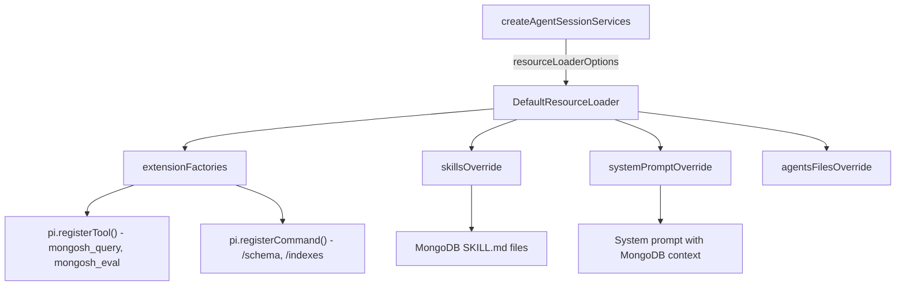

# Mongosh Agent: Custom Tools, Skills, and Commands

## How pi's Extension System Works

Pi provides three main injection points, all routed through `DefaultResourceLoader`:

1. **`extensionFactories`** - Inline functions that receive `pi: ExtensionAPI` and can call `pi.registerTool()`, `pi.registerCommand()`, `pi.on(event, handler)`, etc.
2. **`skillsOverride`** - Append custom `Skill` objects (markdown files with instructions the LLM sees)
3. **`promptsOverride`** / **`systemPromptOverride`** - Add slash commands and modify the system prompt
4. **`agentsFilesOverride`** - Inject `AGENTS.md`-style context files

The current code in [agent.ts](snippets/agent/src/agent.ts) passes a `settingsManager` to `createAgentSessionServices()` but no `resourceLoaderOptions`. We need to add `resourceLoaderOptions` with our customizations.

## Architecture



## Injection Point in agent.ts

In the `createRuntime` factory (line ~110), change `createAgentSessionServices` to pass `resourceLoaderOptions`:

```typescript
const services = await createAgentSessionServices({
  cwd: options.cwd,
  settingsManager,
  resourceLoaderOptions: {
    extensionFactories: [mongoshExtension],
    skillsOverride: (base) => ({
      ...base,
      skills: [...base.skills, ...mongoshSkills],
    }),
    systemPromptOverride: () => mongoshSystemPrompt,
    agentsFilesOverride: (base) => ({
      agentsFiles: [
        ...base.agentsFiles,
        { path: "mongosh-context", content: mongoshContext },
      ],
    }),
  },
});
```

## Proposed Custom Tools

Define via `pi.registerTool()` inside an extension factory. These give the LLM the ability to interact with the connected MongoDB instance:

- **`mongosh_eval`** - Run arbitrary mongosh expressions against the connected database (e.g., `db.collection.find()`, `db.stats()`, etc.). This is the core power tool. It would call the `eval` function from mongosh's shell API passed through `globalThis`.

- **`mongosh_schema`** - Inspect collection schemas by sampling documents and returning inferred field types. Useful for the agent to understand data structure before writing queries.

- **`mongosh_explain`** - Run `explain("executionStats")` on a query to return execution plan details, helping the agent optimize queries.

## Proposed Skills (Markdown Files)

Skills are markdown instructions that get included in the system prompt. They teach the agent domain knowledge:

- **MongoDB Query Expert** - How to write efficient MongoDB queries, use aggregation pipelines, indexes, and common patterns. When to use `$match` vs `$filter`, projection best practices, etc.

- **mongosh Shell Guide** - Available mongosh helpers (`show dbs`, `show collections`, `db.getCollectionNames()`), how to use the admin API, replica set commands, etc.

- **Performance Tuning** - How to read explain plans, identify missing indexes, spot collection scans, and suggest `createIndex()` commands.

## Proposed Slash Commands

Define via `pi.registerCommand()`:

- **`/schema <collection>`** - Quick command to show the inferred schema of a collection
- **`/indexes <collection>`** - Show all indexes on a collection
- **`/explain <query>`** - Run an explain plan on a query

## Proposed System Prompt Override

A system prompt that tells the agent it's running inside mongosh, connected to a MongoDB database, with access to the shell API:

```
You are a MongoDB assistant running inside mongosh.
You are connected to a live MongoDB instance.
Use the mongosh_eval tool to run queries and commands.
Always explain what you're about to do before running queries.
For destructive operations (drop, delete, update), ask for confirmation first.
```

## File Structure

All customizations live in [`snippets/agent/src/agent.ts`](snippets/agent/src/agent.ts) as inline code (extension factories, skill objects, system prompt string). No external files needed since we use `extensionFactories` and `skillsOverride` programmatically.

Skills could alternatively live as separate `.md` files in `snippets/agent/skills/` and be loaded at runtime, which would make them easier to edit independently.
